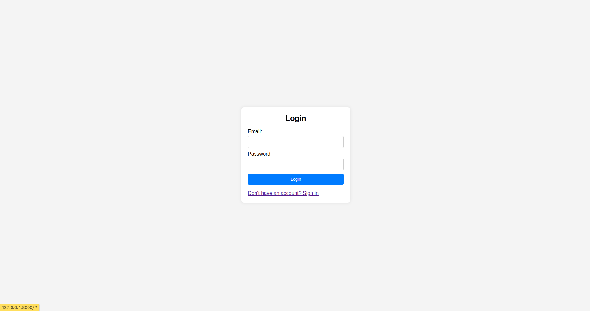
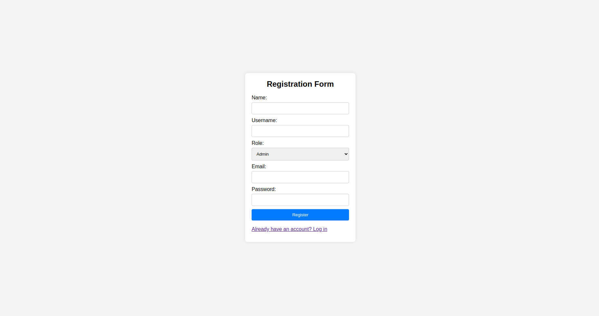
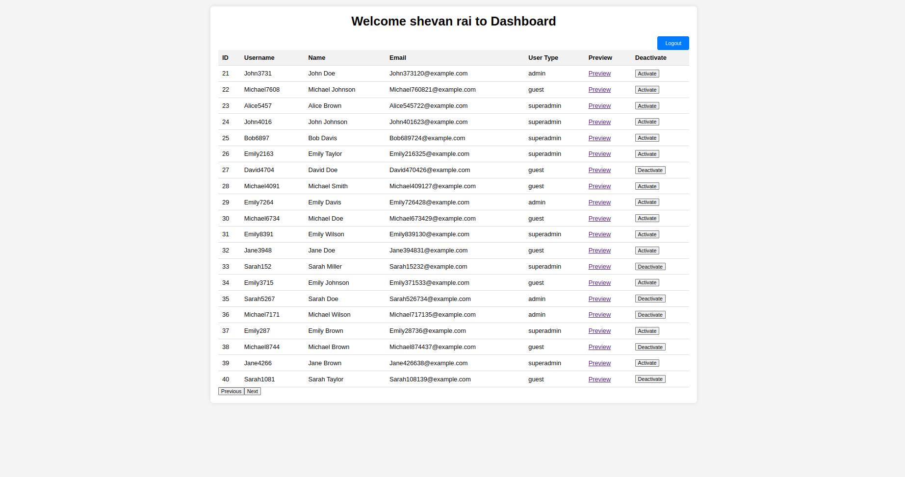
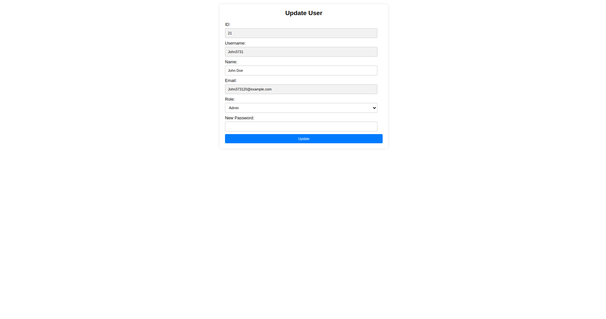

# Project Name - Laravel Web App

## Description
Laravel web application 

## Initial Setup
1. **Install MySQL:** Instructions for installing MySQL.

```bash
sudo apt-get update
sudo apt-get install mysql-server
```
2. **Install Apache Server:** Instructions for installing Apache server.

```bash
sudo apt-get install apache2
```
3. **Set Environment Variables for MySQL:** Instructions for setting environment variables.

Create a .env file similler to .env.example file 
Change following vvariables according to your env

    DB_CONNECTION=mysql
    DB_HOST=127.0.0.1
    DB_PORT=3306
    DB_DATABASE=laravel_web_app_db
    DB_USERNAME=root
    DB_PASSWORD=root

4. **Start MySQL Server:** Command to start MySQL server.

```bash
sudo systemctl start mysql
```
## Creating Database
5. **Run Migrations and Seed Data:** Instructions for running migrations and seeding data.

```bash
cd /path/to/your/laravel/project
```
Run migrations with seed data
```bash
php artisan migrate --seed 
```
or only migrations
```bash
php artisan migrate
```
6. **Start Apache Server:** Command to start Apache server.

```bash
sudo systemctl start apache2
```
## Screenshots










